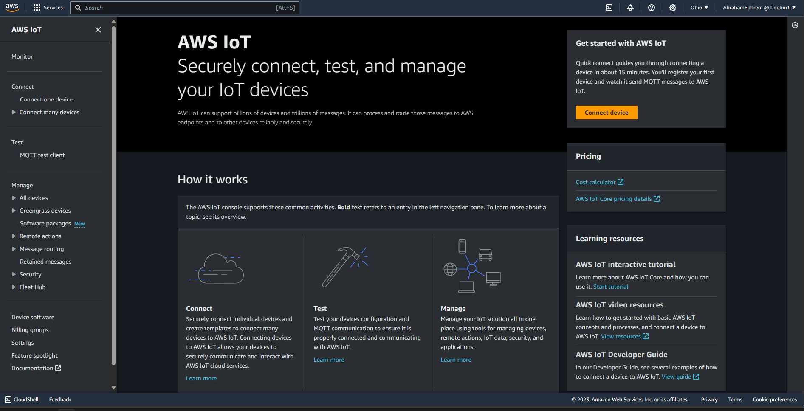
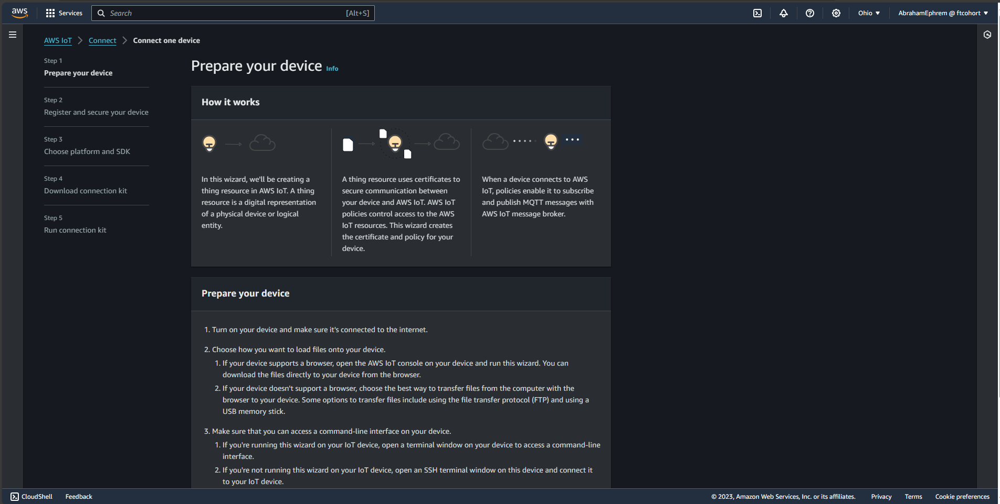

# Kilole Project

##Introduction

This project demonstrates a near real-time data pipeline for IoT devices. The data pipeline uses AWS Services and Terraform to automate the deployment of the AWS resources.


## Service Breakdown

The project uses the following tools:

### AWS IoT Core

We can register an IoT device using this service. In addition, we can create rules on how the data coming from the IoT device is handled. 

### Amazon Kinesis Data Firehose

We used this service to ingest the data from the IoT device into a specific data storage service.

### Amazon Simple Storage Service (S3)

We used this service to store the data ingested from the IoT device.

### Amazon Athena

We used this service to query the data stored in S3 and prepare the data for analysis.

### PowerBI

We used this service to visualize the IoT device data.

## Working with the project

### Prerequisites 

1 - An AWS Account with permissions to access AWS IoT Core, Amazon KDF, Amazon Athena, and Amazon S3. 
2 - AWS CLI access
3 - A complete setup of Terraform

### Steps

1 - Change your directory to the project-kilole folder.
2 - Run 
```hcl
terraform-plan
```
to see the resources that will be deployed.

3 - Run 
```hcl
terraform-apply
```
to deploy the resources.

### Emulating your computer as an IoT device

Navigate to the AWS IoT service and click on 'Connect Device'



Follow the instructions


